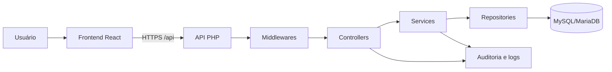

# Arquitetura do Sistema — Mapa da Psiquê

> **Documento:** `docs/02-arquitetura.md`  
> **Status:** versão inicial para validação  
> **Sistema:** Mapa da Psiquê  
> **Produção:** `https://mapapsique.orbisconect.com`  
> **Hospedagem:** Hostinger  
> **Backend de produção:** PHP 8.3  
> **Banco:** MySQL/MariaDB

---

## 1. Objetivo

Este documento descreve a arquitetura técnica do Mapa da Psiquê: frontend, backend, banco de dados, fluxo de requisições, autenticação, segurança, módulos, persistência, versionamento do Canvas e publicação em produção.

Classificação das informações:

- **[CONFIRMADO NO CÓDIGO]**: evidência direta nos arquivos analisados.
- **[CONFIRMADO NO BANCO]**: evidência direta nas migrations.
- **[CONFIRMADO EM PRODUÇÃO]**: comportamento validado no ambiente publicado.
- **[INFORMADO PELA RESPONSÁVEL]**: informação fornecida pela responsável pelo projeto.
- **[PENDENTE DE VALIDAÇÃO]**: informação que ainda precisa ser comprovada.
- **[RECOMENDAÇÃO]**: melhoria técnica, operacional ou de segurança.

---

## 2. Visão geral

**[CONFIRMADO NO CÓDIGO]**

O sistema utiliza uma arquitetura web cliente-servidor composta por:

1. frontend SPA com React, TypeScript e Vite;
2. backend HTTP em PHP, sem framework;
3. API sob o prefixo `/api`;
4. autenticação baseada em sessão PHP;
5. banco MySQL/MariaDB acessado com PDO;
6. backend em camadas: Controllers, Services e Repositories;
7. middlewares e helpers de segurança;
8. frontend e API publicados na mesma origem;
9. frontend compilado como arquivos estáticos;
10. backend publicado em `api/_app`.



---

## 3. Frontend

**[CONFIRMADO NO CÓDIGO]**

Tecnologias:

```text
React 19
TypeScript 5.7
Vite 6
Tailwind CSS 3.4
ESLint 9
```

Arquivos principais:

```text
frontend/src/main.tsx
frontend/src/app/App.tsx
frontend/src/shared/api/httpClient.ts
```

Build:

```powershell
cd frontend
npm ci
npm run lint
npm run build
```

Saída:

```text
frontend/dist/
```

Variável da API:

```text
VITE_API_BASE_URL=/api
```

A navegação principal é controlada por estado no `App.tsx`, com as visões:

```text
login
register
forgot-password
reset-password
consent
protected
```

As requisições usam `credentials: "include"`, permitindo o envio do cookie de sessão.

Módulos ativos identificados:

```text
auth
consents
dashboard
patients
maps
protected
```

Diretórios previstos, mas ainda sem implementação funcional confirmada:

```text
ai-analysis
audit
files
```

---

## 4. Backend

**[CONFIRMADO NO CÓDIGO]**

Estrutura principal:

```text
backend/
├── public/
├── src/
│   ├── Config/
│   ├── Controllers/
│   ├── Database/Repositories/
│   ├── Http/
│   ├── Middleware/
│   ├── Modules/
│   ├── Security/
│   └── Support/
├── migrations/
└── storage/
```

Ponto de entrada:

```text
backend/public/index.php
```

Bootstrap:

```text
backend/src/bootstrap.php
```

O backend tenta utilizar `vendor/autoload.php`. Na ausência dele, usa autoload interno com o mapeamento:

```text
App\ → backend/src/
```

O roteador próprio registra rotas por método HTTP, reconhece parâmetros como `{id}`, instancia controllers e retorna 404 quando nenhuma rota corresponde.

---

## 5. Fluxo de requisição

**[CONFIRMADO NO CÓDIGO]**

```text
Navegador
→ frontend React
→ backend/public/index.php
→ carregamento do bootstrap e .env
→ SecurityHeadersMiddleware
→ CorsMiddleware
→ RateLimitMiddleware
→ Router
→ Controller
→ Service
→ Repository
→ MySQL/MariaDB
→ resposta JSON ou PDF
```

Requisições `OPTIONS` de preflight recebem HTTP 204.

---

## 6. Autenticação e sessão

**[CONFIRMADO NO CÓDIGO]**

A autenticação usa sessão PHP.

Fluxo de login:

```text
normalização do e-mail
→ busca do usuário
→ verificação da senha
→ validação de status active
→ regeneração do ID da sessão
→ criação da sessão
→ atualização do último login
→ auditoria
```

Dados da sessão:

```text
user_id
role
authenticated_at
expires_at
```

Cookie:

```text
HttpOnly = true
SameSite = Lax
Path = /
Secure = true em produção
```

Duração padrão:

```text
120 minutos
```

A senha usa Argon2id, com fallback para bcrypt. A política atual exige pelo menos oito caracteres, uma letra e um número.

A recuperação de senha usa token aleatório, armazenamento apenas do hash SHA-256, validade de uma hora e uso único.

**[RECOMENDAÇÃO]** Invalidar sessões existentes após redefinição de senha.

---

## 7. Autorização e consentimento

**[CONFIRMADO NO CÓDIGO]**

O `AccessGuard` combina:

1. autenticação;
2. validação do usuário ativo;
3. validação do consentimento vigente;
4. autorização por perfil.

Pacientes e mapas exigem o perfil:

```text
profissional
```

**[CONFIRMADO NO BANCO]** Perfis previstos:

```text
administrador
profissional
paciente
auditor
```

**[PENDENTE DE VALIDAÇÃO]** Funcionalidades efetivas para administrador, paciente e auditor.

O sistema consulta o termo ativo e verifica se o usuário já o aceitou. Sem aceite, a área protegida não é liberada.

---

## 8. CSRF e segurança HTTP

**[CONFIRMADO NO CÓDIGO]**

O token CSRF é solicitado em:

```text
GET /api/csrf-token
```

É gerado com `random_bytes(32)`, armazenado na sessão e enviado no cabeçalho:

```text
X-CSRF-Token
```

A comparação usa `hash_equals()`. Falhas retornam HTTP 419.

O CSRF só pode ser ignorado quando `CSRF_ENABLED=false` e `APP_ENV=local`.

Controles identificados:

```text
sessão autenticada
cookie HttpOnly
cookie Secure em produção
SameSite=Lax
CSRF
CORS
rate limiting
security headers
prepared statements
sanitização
validação
isolamento por owner_user_id
autorização por perfil
consentimento
soft delete
auditoria
```

Headers identificados:

```text
X-Content-Type-Options
X-Frame-Options
Referrer-Policy
Permissions-Policy
Content-Security-Policy
```

---

## 9. Pacientes

**[CONFIRMADO NO CÓDIGO]**

Campos principais:

```text
id
owner_user_id
name
internal_code
age
notes
status
created_at
updated_at
deleted_at
deleted_by
```

Status:

```text
active
inactive
archived
```

Todas as operações são isoladas por `owner_user_id`.

Arquivamento:

```text
status = archived
deleted_at = CURRENT_TIMESTAMP
deleted_by = usuário responsável
```

Reativação:

```text
status = active
deleted_at = NULL
deleted_by = NULL
```

Busca por nome e código interno, com paginação máxima de 50 registros.

**[RECOMENDAÇÃO]** Impedir `archived` no endpoint comum de atualização e reservar o arquivamento para a rota específica.

---

## 10. Mapas

**[CONFIRMADO NO CÓDIGO]**

Campos principais:

```text
id
owner_user_id
patient_id
title
reason
status
canvas_json
created_at
updated_at
deleted_at
deleted_by
```

Status:

```text
draft
ready_for_analysis
analyzed
archived
```

Na criação, o backend força:

```text
status = draft
canvas_json = null
owner_user_id = usuário autenticado
```

O backend impede novos vínculos com pacientes arquivados e pacientes pertencentes a outro usuário. Mapas existentes permanecem vinculados quando o paciente é arquivado.

**[CONFIRMADO NO CÓDIGO]** A listagem mantém `patient_name` e `patient_status` de pacientes arquivados. No detalhe, o nome pode desaparecer porque o JOIN exige `patients.deleted_at IS NULL`.

**[RECOMENDAÇÃO]** Remover essa condição do JOIN detalhado, preservando o isolamento por proprietário.

Mapas usam soft delete. O filtro `archived` está inconsistente porque a listagem sempre exige `maps.deleted_at IS NULL`.

**[RECOMENDAÇÃO]** Corrigir o filtro e impedir `archived` na atualização comum.

---

## 11. Canvas e versões

**[CONFIRMADO NO CÓDIGO]**

O Canvas textual possui nove campos:

```text
main_demand
current_context
emotional_history
recurring_patterns
core_beliefs
defense_strategies
internal_resources
reflective_hypotheses
next_steps
```

O conteúdo atual é armazenado em `maps.canvas_json`.

Cada salvamento do Canvas ocorre em transação e cria uma versão em `map_canvas_versions` com o resumo:

```text
Snapshot do canvas
```

A tabela de versões contém:

```text
id
map_id
user_id
version_number
canvas_data
summary
created_at
```

Há restrição única por `(map_id, version_number)`.

Na restauração:

```text
inicia transação
→ bloqueia o mapa com FOR UPDATE
→ valida propriedade
→ busca a versão
→ valida o JSON
→ cria backup do Canvas atual
→ substitui canvas_json
→ confirma a transação
```

Resumo do backup:

```text
Snapshot automático antes da restauração
```

A interface exige a palavra `RESTAURAR` para confirmar.

**[RECOMENDAÇÃO]** Validar o schema e o tamanho dos campos do Canvas e criar uma coluna explícita `version_type`.

---

## 12. Exportação PDF

**[CONFIRMADO NO CÓDIGO]**

Rotas:

```text
GET /api/maps/{id}/export/pdf
GET /api/maps/{id}/canvas-versions/{versionId}/export/pdf
```

É possível exportar o mapa atual e uma versão histórica. O PDF histórico inclui número, data e resumo da versão.

**[PENDENTE DE VALIDAÇÃO]** Documentar internamente o `MapPdfExporter` em seção específica.

---

## 13. Banco de dados

**[CONFIRMADO NO BANCO]**

Tecnologia:

```text
MySQL/MariaDB
InnoDB
utf8mb4
utf8mb4_unicode_ci
```

Entidades atualmente usadas:

```text
users
patients
maps
map_canvas_versions
audit_logs
consent_terms
user_consents
password_reset_tokens
```

Estruturas previstas para expansão:

```text
map_items
map_arrows
map_notes
map_files
knowledge_files
ai_prompt_templates
map_analyses
ai_processing_logs
```

Essas estruturas de IA, arquivos e Canvas gráfico ainda não devem ser tratadas como funcionalidades disponíveis.

---

## 14. Auditoria

**[CONFIRMADO NO CÓDIGO E NO BANCO]**

A auditoria registra ações de autenticação, consentimento, pacientes, mapas, histórico e PDF, incluindo usuário, entidade, rota, método HTTP, IP e user agent.

A tabela `audit_logs` possui triggers que impedem UPDATE e DELETE, mantendo comportamento append-only.

**[RECOMENDAÇÃO]** Complementar as triggers com privilégios mínimos no MySQL, backups, monitoramento e registro técnico de falhas de auditoria.

---

## 15. Dados pessoais e LGPD

**[CONFIRMADO NO CÓDIGO E NO BANCO]**

O sistema pode armazenar nome, e-mail, idade, observações, motivo do mapa, história emocional, padrões, crenças, estratégias de defesa, hipóteses, próximos passos, IP, user agent e auditoria.

Esses dados podem incluir dados pessoais sensíveis relacionados à saúde e ao contexto psicológico.

O termo ativo versão 1.0 declara estar sujeito à validação jurídica definitiva.

**[PENDENTE DE VALIDAÇÃO]**

```text
criptografia em repouso
política de retenção
anonimização
eliminação de dados
atendimento a direitos do titular
backup criptografado
```

---

## 16. Produção e deploy

**[INFORMADO PELA RESPONSÁVEL]**

Domínio:

```text
https://mapapsique.orbisconect.com
```

Caminho no servidor:

```text
/home/u754689460/domains/mapapsique.orbisconect.com/public_html
```

Estrutura publicada:

```text
public_html/
├── index.html
├── assets/
├── api/
│   ├── index.php
│   ├── .htaccess
│   └── _app/
│       ├── public/
│       ├── src/
│       ├── storage/
│       └── .env
└── .htaccess
```

Branches:

```text
main   = código-fonte
deploy = arquivos preparados para produção
```

Não deve ser feito merge direto de `main` em `deploy`.

Arquivos de runtime que não podem ser versionados ou apagados:

```text
api/_app/.env
api/_app/storage/temp/rate-limit/*.json
api/_app/storage/uploads/
```

Atualização do servidor:

```bash
cd /home/u754689460/domains/mapapsique.orbisconect.com/public_html
git checkout deploy
git pull --ff-only origin deploy
```

---

## 17. Limitações e riscos identificados

1. pacientes e mapas podem receber `archived` pela atualização comum sem preencher os campos de soft delete;
2. filtro de mapas arquivados incompatível com `deleted_at IS NULL`;
3. nome do paciente arquivado pode desaparecer no detalhe do mapa;
4. respostas da API usam envelopes diferentes;
5. numeração de versões usa `MAX + 1`, embora exista restrição única no banco;
6. falhas de auditoria são ignoradas silenciosamente;
7. não foi localizada política de retenção;
8. algumas migrations não são idempotentes;
9. há índices potencialmente duplicados;
10. termo de consentimento ainda precisa de validação jurídica definitiva.

---

## 18. Recomendações prioritárias

### Alta prioridade

1. impedir `archived` na atualização comum de pacientes e mapas;
2. corrigir o filtro de mapas arquivados;
3. preservar o nome do paciente arquivado no detalhe do mapa;
4. definir oficialmente o comportamento de mapas arquivados;
5. revisar juridicamente o termo de consentimento;
6. documentar backup e restauração;
7. confirmar privilégios mínimos do usuário MySQL;
8. definir retenção de dados e versões.

### Média prioridade

1. padronizar respostas da API;
2. validar o schema do Canvas;
3. tratar concorrência na numeração das versões;
4. registrar falhas de auditoria em log técnico;
5. invalidar sessões após redefinição de senha;
6. limpar tokens expirados e usados;
7. revisar índices duplicados;
8. documentar rollback de migrations.

---

## 19. Pendências de validação

- implementação completa do `MapPdfExporter`;
- janela e persistência do rate limiter;
- configuração exata do CORS;
- conteúdo exato dos Security Headers;
- revogação de consentimento;
- schema real do banco de produção;
- privilégios do usuário MySQL;
- política de backup e retenção;
- rotação de logs;
- permissões do storage;
- comportamento oficial de mapas arquivados;
- processo formal de rollback;
- criptografia dos dados e backups.

---

## 20. Resumo

O Mapa da Psiquê possui uma arquitetura modular e compatível com a Hostinger. O frontend e a API são publicados na mesma origem. O backend utiliza sessão, CSRF, autorização, consentimento, rate limiting, headers de segurança, prepared statements, isolamento por proprietário, soft delete e auditoria.

Módulos confirmados:

```text
autenticação
recuperação de senha
consentimento
dashboard
pacientes
mapas
Canvas textual
histórico e restauração de versões
exportação PDF
auditoria
```

O banco também prevê Canvas gráfico, arquivos, notas e IA, mas essas estruturas ainda não estão confirmadas como funcionalidades ativas.

---

## 21. Histórico do documento

| Versão | Data | Descrição |
|---|---|---|
| 0.1 | 10/07/2026 | Primeira versão consolidada da arquitetura técnica |
